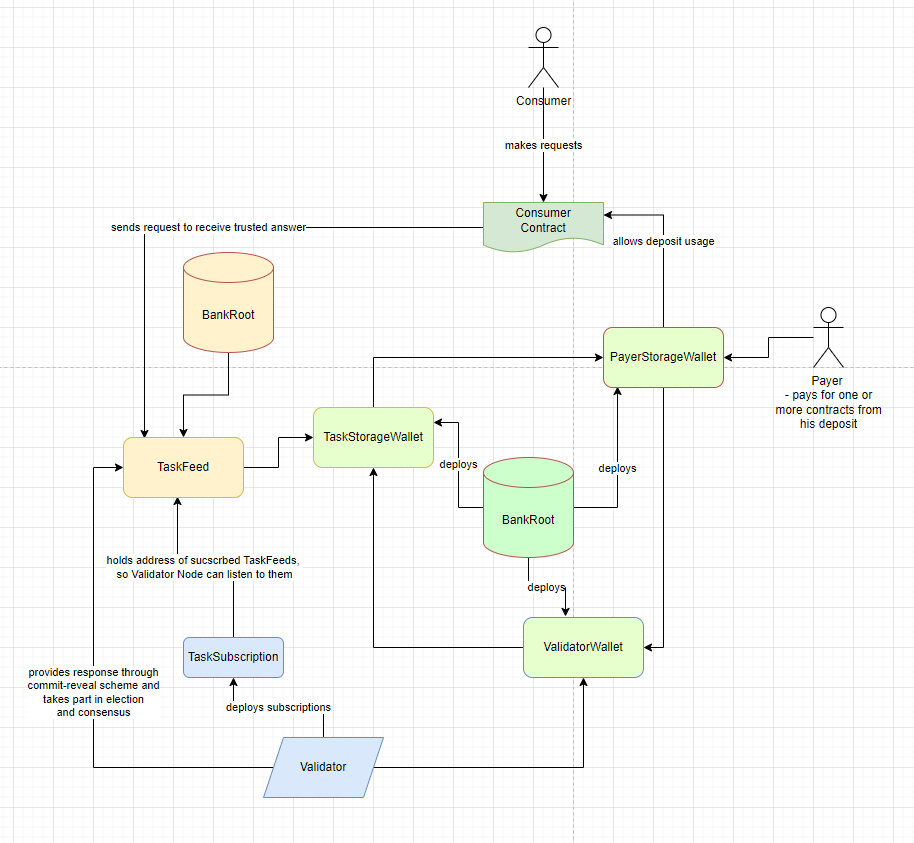
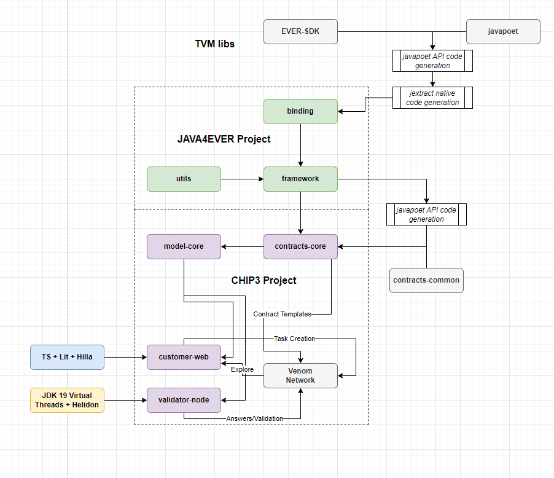

# CHIP3 | Oracle Web3 Service

CHIP3 is Decentralized Oracle Protocol for acquiring arbitrary
offline info for DeFi usage, providing new possibilities
like algorithm stablecoins, perpetual trades & prediction markets.

Each task consist of composable blocks (Actions) that can
be constructed in a customer web suite (see Constructor).

Supports both precise and medianized
consensus (each task runs separate elections).
Tasks can be made as
run-on-request, as schedules or data feeds with deviation thresholds.

## Demo

- [Video Demo](https://www.youtube.com/watch?v=roAym088vT0)
- [Web3 Demo App](http://chip3.deplant.tech)
- [T-Sol Contracts](https://github.com/deplant/venom-oracle/tree/master/contracts/src/main/solidity)

## Quick Resources

- [Documentation](http://docs.deplant.tech)
- [Github](https://github.com/deplant/venom-oracle)
- [Support](https://t.me/Laugan)

## Contract Architecture

Oracle protocol constists of following entities:

- **Consumer** - smart-contract that makes requests or awaits responses from Oracle
- **Payer** - Owner of Bank deposit, that allowed spending to Consumer contract 
- **Bank** - Collection of Payer deposits, Task deposits and Validator deposits, managed in a distributed way
- **Task** - Sequence of actions that Validator Node should execute and provide answer, wrapped in a smart-contract. Also, every Task is an Elector that processes Validators consensus.
- **Validator** - smart-contract that is used by Node to send answers to Tasks and stakes to Bank



You check deployed contracts in the Venom DevNet here:

- **Token Root**: 0:a3682fd1814f293cbf7ba69f5678533bc8576d226a369b6fa07a66073d1d54b1
- **Test Faucet**: 0:9cae4d2963605798616a325f2d8a19603acc1d98990be664a8a39a19798f0f5e
- **Bank Root**: 0:0e026e6eace4f079e974af51f6aa376e03bd7c7da8f9ccfcec0404c9ccab3401
- **Task Factory**: 0:77e851d143521d08797586d100732344b59d427827967d81b7b290555b4165b1

## Tech Resources

- [T-Sol Contracts](https://github.com/deplant/venom-oracle/tree/master/contracts/src/main/solidity)
- [Contract Deployment Artifacts](https://github.com/deplant/venom-oracle/tree/master/contracts/src/main/resources/artifacts)
- [JDK Framework Github](https://github.com/deplant/java4ever-framework)

## Connect your contract

- Get [interface for your consumer](https://github.com/deplant/venom-oracle/tree/master/contracts/src/main/solidity/consumer/int)
- Get [interface for your task](https://github.com/deplant/venom-oracle/tree/master/contracts/src/main/solidity/task/int)
- Here is the example of contract for getting answer out of Medianized Feed:

```
pragma ever-solidity ^0.64;

import "./int/IMedianizedConsumer.tsol";
import "../task/int/IMedianizedFeed.tsol";

contract ExampleConsumerTest is IMedianizedConsumer {

    uint128 _medianizedResult;
    address _currentTask;

    constructor() public {
        require(msg.pubkey() == tvm.pubkey(), 199); //NOT_MY_OWNER
        tvm.accept();
    }

    // ****************************************************************
    // Getter
    // ****************************************************************

    function getMedianizedResult() external view returns (uint128) {
        return _medianizedResult;
    }

    // ****************************************************************
    // External
    // ****************************************************************

    function calculateMedianizedFeed(address taskAddress_, address payerAddress_) external {
		// << CALL THIS METHOD TO GET RESPONSE >> 
        require(taskAddress_.value != 0, 444);
        require(msg.pubkey() == tvm.pubkey(), 199); //NOT_MY_OWNER
        tvm.accept();
        _currentTask = taskAddress_;
        IMedianizedFeed(taskAddress_).medianizedFeedRequest{value: 500_000_000, flag: 1, bounce: true}(payerAddress_);
    }

    function medianizedCallback(uint128 response_) override external internalMsg {
        require(msg.sender == _currentTask && msg.sender.value != 0, 198); // NOT_AWAITED_TASK
        _medianizedResult = response_;
		// << INSERT YOUR ACTIONS AFTER ORACLE RESPONSE HERE >> 
    }

}	
```

## Tech Stack



## Tests

### Prerequisites

- [JDK 19](https://adoptium.net/temurin/releases/?version=19)
- [EVER-SDK lib](https://github.com/tonlabs/ever-sdk#download-precompiled-binaries) for your OS
- Set LOCAL_NODE_ENDPOINT environment variable to your EVER OS node
- Set TON_CLIENT_LIB environment variable to EVER-SDK lib path

### How to test oracle contracts

- Clone this repo
- Go to contracts `cd contracts`
- Run `gradlew test --tests "tech.deplant.osiris.contract.test.junit.sequence.TokenSequenceTest" -D--enable-preview -D--add-modules=jdk.incubator.concurrent -D--enable-native-access=ALL-UNNAMED`
- Run `gradlew test --tests "tech.deplant.osiris.contract.test.junit.sequence.BankSequenceTest" -D--enable-preview -D--add-modules=jdk.incubator.concurrent -D--enable-native-access=ALL-UNNAMED`
- Run `gradlew test --tests "tech.deplant.osiris.contract.test.junit.sequence.TaskSequenceTest" -D--enable-preview -D--add-modules=jdk.incubator.concurrent -D--enable-native-access=ALL-UNNAMED`
- Run `gradlew test --tests "tech.deplant.osiris.contract.test.junit.sequence.ValidatorSequenceTest" -D--enable-preview -D--add-modules=jdk.incubator.concurrent -D--enable-native-access=ALL-UNNAMED`
- Run `gradlew test --tests "tech.deplant.osiris.contract.test.junit.sequence.ConsumerSequenceTest" -D--enable-preview -D--add-modules=jdk.incubator.concurrent -D--enable-native-access=ALL-UNNAMED`

